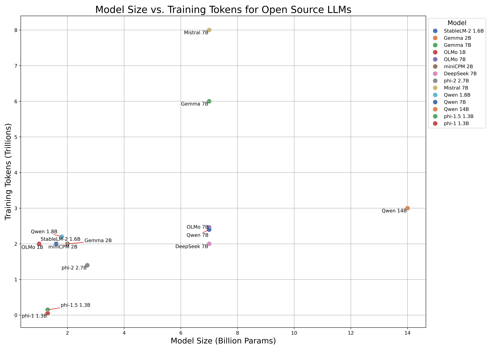

# Key Resources and Configurations for Open Source Large Language Models (LLMs)

> Contributed by [Xuekai Zhu](https://xuekai-zhu.github.io/Xuekai-Zhu/), Kaiyan Zhang, [Jushi Kai](https://scholar.google.com/citations?user=W85K17gAAAAJ&hl=zh-CN), [Shixiang Song](https://github.com/shixiangsong)

****
**We present a comprehensive table outlining the key resources and configurations for Open Source LLMs. We hope this table can help you quickly check whether your accessible resource can support the LLMs party.**

-----

| Release Date | Model      | Affiliation                                 | Size            | Source Data Size (Tokens)              | Training Tokens                                              | Learning Rate    | Batch Size (tokens)     | Architecture      | Context Length | Vocabulary Size | Tokenizer                            | Precision                      | GPU Hours     | Infrastructure                   | Optimizer                                 | Training Layout                                    | Language          |
| ------------ | ---------- | ------------------------------------------- | --------------- | -------------------------------------- | ------------------------------------------------------------ | ---------------- | ----------------------- | ----------------- | -------------- | --------------- | ------------------------------------ | ------------------------------ | ------------- | -------------------------------- | ----------------------------------------- | -------------------------------------------------- | ----------------- |
| 2024/02      | StableLM 2 | Stability AI Language Team                  | 1.6B            | -                                      | 2T                                                           | 1e−3 (max)       | 8, 388, 608             | decoder-only      | 4096           | 100,352         | Arcade100k tokenizer                 | BF16/FP32 （mixed precision ） | 92k           | 512 NVIDIA A100 (40GB HBM2) GPUs | AdamW (0.9/0.95)                          | FlashAttention-2, ZeRO stage 1                     | multilingual      |
| 2024/02      | Gemma      | Gemma Team, Google DeepMind                 | 2B / 7B         | -                                      | 2T / 6T                                                      | -                | -                       | decoder-only      | 8192           | 256k            | Gemini tokenizer                     | -                              | -             | TPU                              | -                                         | similar ZeRO-3                                     | English           |
| 2024/02      | OLMo       | Allen Institute for Artificial Intelligence | 1B / 7B         | [3T](https://github.com/allenai/dolma) | 2T / 2.46T                                                   | 4e-4 / 3e-4      | ~4M(2048 * 2048)        | decoder-only      | 2048           | 50,280          | GPT-NeoX-20B                         | BF16(mixed precision)          |               | 216  NVIDIA A100 GPUs            | AdamW                                     | ZeRO optimizer strategy , PyTorch’s FSDP framework | English           |
| 2024/01      | miniCPM    | Modelbest Inc., THUNLP                      | 2B              | -                                      | 2T (1+1)                                                     | 1e-2 (max)       | ～4M                    | decoder-only      | -              | 122, 753        | sentencepiece(BPE)                   | BF16                           | -             | -                                | Warmup-Stable-Decay（WSD）(new proposed ) | cosine lr-scheduler                     | English / Chinese |
| 2024/01      | DeepSeek   | DeepSeek-AI                                 | 7B              | -                                      | 2T                                                           | 4.2e-4  (0.1 wd) | 9,437,184 (2304 * 4096) | decoder-only      | 4096           | 102, 400        | Byte-level Byte-Pair Encoding (BBPE) | BF16/FP32 （mixed precision ） | -             | -                                | AdamW                                     | Flash attention, ZeRO-1                            | English           |
| 2023/12      | phi-2      | Microsoft                                   | 2.7B            | 250B                                   | 1.4T                                                         | -                | -                       | encoder-decoder   | 2048           | -               | -                                    | -                              | 336 (14 days) | 96 A100 GPUs.                    | -                                         | -                                                  | English           |
| 2023/10      | Mistral    | Mistral AI                                  | 7B              | -                                      | [~ 8T]( https://www.interconnects.ai/p/gemma-google-ships-it?utm_source=profile&utm_medium=reader2) | -                | -                       | transformer-based | 8192           | 32000           | -                                    | -                              | -             | -                                | -                                         | sliding window attention, grouped-query attention  | English, code     |
| 2023/09      | Qwen       | Qwen Team, Alibaba Group                    | 1.8B / 7B / 14B | 3T                                     | 2.2T / 2.4T / 3.0T                                           | 3e-4             | ~ 4M                    | Decoder-only      | 2048           | 152K            | Qwen                                 | BF16                           | -             | -                                | AdamW                                     | Flash Attention, cosine learning rate schedule     | multilingual      |
| 2023/09      | phi-1.5    | Microsoft                                   | 1.3B            | 30B                                    | 150B                                                         | 2e−4 (0.1 wd)    | 4,194,304(2048 * 2048)  | encoder-decoder   | 2048           | f               | codegen-mono                         | FP16                           | 192(8 days)   | 32xA100-40G                      | Adam                                      | ZeRO-2                                             | English           |
| 2023/07      | LLaMA-2        | Meta                                  | 7B / 13B / 34B / 70B / chat | -        | 2.0T     | 3e-4 (7B, 13B), 1.5e-4 (34B, 70B)     | 4M        | decoder-only      | 4096      | 32k       | SentencePiece (BPE)     | -        | 184k (7B)      | A100-80GB     | AdamW     | cosine lr-scheduler, grouped-query attention, Ghost Attention     | English       |
| 2023/06      | phi-1      | Microsoft                                   | 1.3B            | 7B                                     | 50B                                                          | 1e-3 (0.1 wd)    | 2,097,152(1024*2048)    | encoder-decoder   | 2048           | -               | codegen-mono                         | FP16                           | 96 (4 days)   | 8 xA100                          | Adam                                      | Flash Attention                                    | English           |
| 2023/04       | Pythia        | EleutherAI  | 14M(not in the report, in hf only)/70M/160M/410M/1B/1.4B/2.8B/6.9B/12B| 800G(300B)  | 300B/203B(deduplicated)     | 1e-3(70M)/6e-4(160M)/3e-4(410M,1B)/2e-4(1.4B)/1.6e-4(2.8B)/1.2e-4(6.9B,12B)     | 2M        | decoder-only      | 2048    | 50,276     | GPTNeoXTokenizer     | FP16     |510(70M)/1,030(160M)/2,540(410M)/4,830(1B)/7,120(1.4B)/14,240(2.8B)/33,500(6.9B)/72,300(12B); 136,070 in total     | A100-40GB     | Adam， ZeRO     | cosine lr-scheduler     | English       |
| 2023/02       | LLaMA         | Meta                      | 7B / 13B / 33B / 65B      | -        | 1.0T(7B, 13B), 1.4T(33B, 65B)     | 3e-4 (7B, 13B), 1.5e-4 (33B, 65B)     | 4M        | decoder-only      | 2048      | 32k     | SentencePiece (BPE)     | -        | 82k (7B)     | A100-80GB     | AdamW     | cosine lr-scheduler     | English       |

"-" indicates not mentioned in their technical reports.

----

**The figure below illustrates the combinations of model sizes and training tokens for LLMs.  We can see that most 2B models are pre-trained with approximately 2 trillion tokens.**

### **Reference**

- [Gemma: Open Models Based on Gemini Research and Technology](https://blog.google/technology/developers/gemma-open-models/)
- [Textbooks Are All You Need](https://arxiv.org/abs/2306.11644)
- [Textbooks Are All You Need II: phi-1.5 technical report](https://arxiv.org/abs/2309.05463)
- [Phi-2: The surprising power of small language models](https://www.microsoft.com/en-us/research/blog/phi-2-the-surprising-power-of-small-language-models/)
- [Stable LM 2 1.6B Technical Report](https://arxiv.org/abs/2402.17834)
- [MiniCPM: Unveiling the Potential of End-side Large Language Models](https://shengdinghu.notion.site/MiniCPM-Unveiling-the-Potential-of-End-side-Large-Language-Models-d4d3a8c426424654a4e80e42a711cb20)
- [DeepSeek LLM Scaling Open-Source Language Models with Longtermism](https://arxiv.org/abs/2401.02954)
- [Mistral 7B](https://arxiv.org/abs/2310.06825)
- [Llama 2: Open Foundation and Fine-Tuned Chat Models](https://arxiv.org/abs/2307.09288)
- [LLaMA: Open and Efficient Foundation Language Models](https://arxiv.org/abs/2302.13971)
- [Pythia: A Suite for Analyzing Large Language Model](https://arxiv.org/pdf/2304.01373.pdf)
